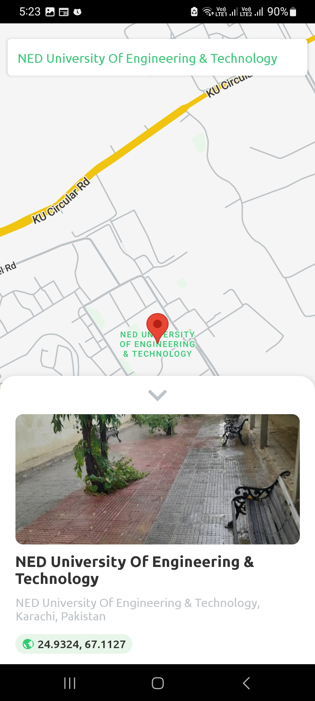
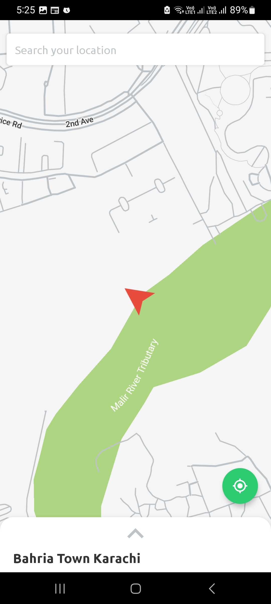
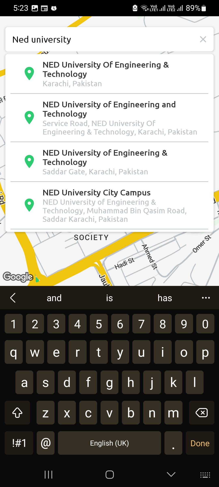
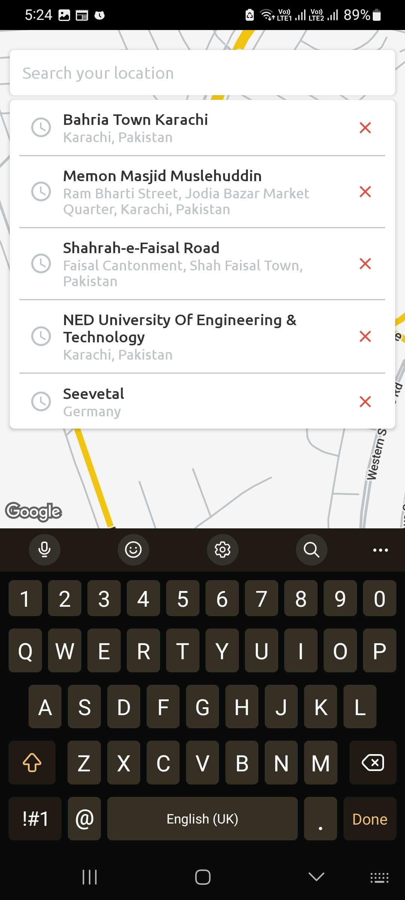
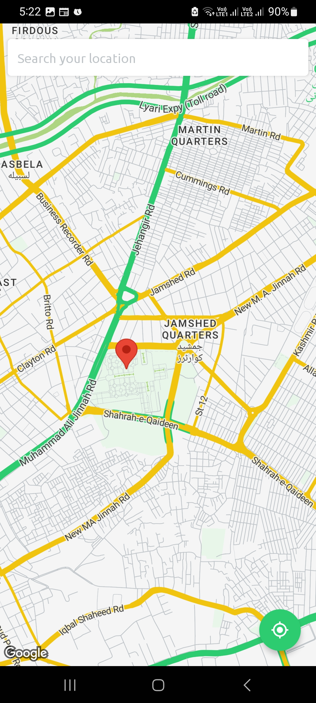
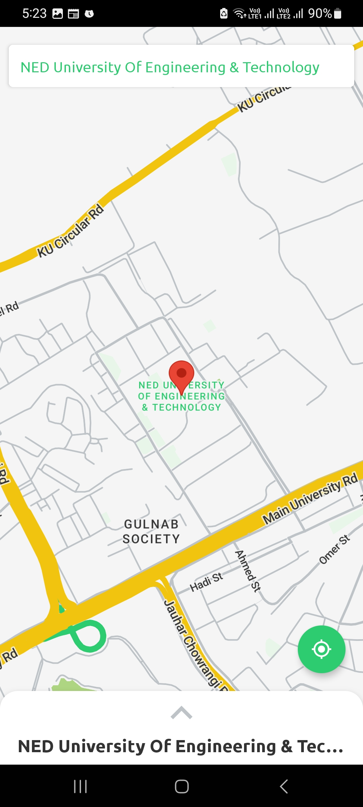
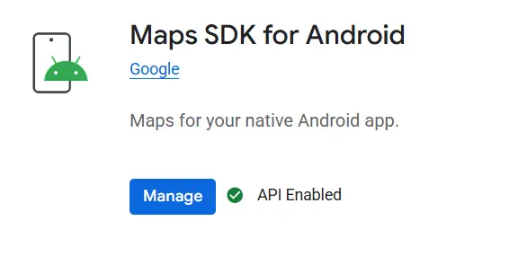
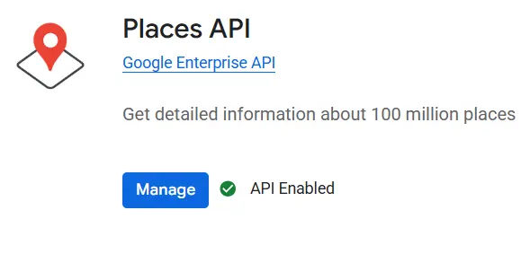

# 📍 <font color="#2ECC71">LocateMe</font>: Your Ultimate Location Finder

<p align="center">
  
</p>

<p align="center">
  <strong>Find, save, and explore any location with ease!</strong>
</p>
<p align="center">
LocateMe is a sleek React Native app that lets you search places on the map, view details, and keep a history of your searches — perfect for trip planning or exploring new spots.</p>

## ✨ Features

- **🗺️ Interactive Map:** A beautiful and responsive map to explore the world.
- **🔍 Powerful Search:** Find any location with real-time search predictions.
- **ℹ️ Place Details:** Get rich information about any place, including address, coordinates, and photos.
- **⭐ Ratings and Reviews:** See what others think with integrated place ratings.
- **📍 Marker Indicator:** Displays a dynamic marker at the selected location, updates in real-time as you move the map, and highlights the exact coordinates..
- **📜 Search History:** Keep track of your past searches for quick access.
- **👆 Bottom Sheet:** A smooth, animated bottom sheet to display place information without cluttering the map.
- **🔄 Recenter Button:** Easily get back to your selected location with a single tap.
- **🎨 Custom Map Styles:** A visually appealing map style for a better user experience.

## 📸 App Screenshots

<table>
  <tr>
    <td align="center"></td>
    <td align="center"></td>
    <td align="center"></td>
  </tr>
  <tr>
    <td align="center"></td>
    <td align="center"></td>
    <td align="center"></td>
  </tr>
</table>

## 🚀 Getting Started

Follow these instructions to get the project up and running on your local machine.

### ✅ Prerequisites

- **Node.js:** Make sure you have Node.js version `22.12.0` or higher installed.
- **Yarn or npm:** This project uses either Yarn or npm for package management.

### ⚙️ Installation

1.  **Clone the repository:**
    ```sh
    git clone https://github.com/your-username/locateme.git
    cd locateme
    ```

2.  **Install dependencies:**
    ```sh
    # Using npm
    npm install

    # OR using Yarn
    yarn install
    ```

### 🔑 Google Cloud API Setup

To use the map and location services, you need to enable the **Maps SDK for Android** and the **Places API** in the Google Cloud Console.

1.  **Enable Maps SDK for Android:**
    - Go to the [Google Cloud Console](https://console.cloud.google.com/).
    - Navigate to **APIs & Services > Library**.
    - Search for **Maps SDK for Android** and enable it.
    <p align="center">
      
    </p>

2.  **Enable Places API:**
    - In the same library, search for **Places API** and enable it.
    <p align="center">
      
    </p>

3.  **Get API Key:**
    - After enabling the APIs, go to **APIs & Services > Credentials** and create a new API key.
    - Copy the generated API key.

4.  **Create `.env` file:**
    - In the root of the project, create a new file named `.env`.
    - Add your API key to the `.env` file as follows:
      ```
      GOOGLE_PLACES_API_KEY=your_api_key_here
      ```
